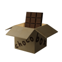
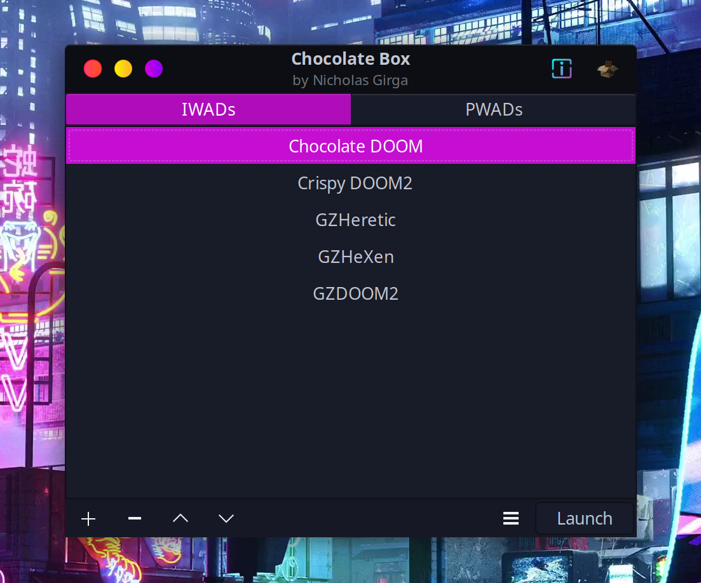

# Chocolate Box
 Simple GUI for [Chocolate DOOM](https://github.com/chocolate-doom/chocolate-doom) (and other DOOM source ports)




# Features
 - Stores paths to [IWADs](https://gitlab.com/nickgirga/chocolate-box/-/wikis/home#what-is-an-iwad-or-a-pwad)
 - Stores paths to [PWADs](https://gitlab.com/nickgirga/chocolate-box/-/wikis/home#what-is-an-iwad-or-a-pwad)
 - Supports numerous [source ports](https://gitlab.com/nickgirga/chocolate-box/-/wikis/home#what-is-a-source-port)
 - Stores path to preferred source port along with IWAD
   - Allows custom executable paths
   - Allows you to override the stored source port path temporarily
 - Supports `-file` and `-merge` [modifications](https://gitlab.com/nickgirga/chocolate-box/-/wikis/home#how-do-i-use-mods)
   - Can use [numerous modifications](https://gitlab.com/nickgirga/chocolate-box/-/wikis/home#enablingdisabling-pwads) at the same time
 - Keyboard shortcuts for quick navigation
 - Provides a unified interface for all of your DOOM setups
   - This is useful if you want to share a controller scheme across multiple source ports using [Steam Input](https://partner.steamgames.com/doc/features/steam_controller/getting_started_for_players)


Note: The `-merge` feature will only work with source ports that support it (e.g. Chocolate DOOM). You can find more information about the `-merge` feature in Chocolate DOOM [here](https://github.com/chocolate-doom/chocolate-doom#playing-tcs).


# Looking for Releases?
We will be utilizing [GitLab releases](https://gitlab.com/nickgirga/chocolate-box/-/releases) to distribute versioned releases and [GitLab CI](https://gitlab.com/nickgirga/chocolate-box/-/pipelines) for nightly releases built for Arch, Debian, and Ubuntu.

What does that mean for you as a user? Looking for official releases (easy)? Go to [releases](https://gitlab.com/nickgirga/chocolate-box/-/releases). Looking for bleeding edge development builds (advanced)? Go to [CI pipelines](https://gitlab.com/nickgirga/chocolate-box/-/pipelines).

Releases will typically be distributed as Arch or Debian-based packages (`[package_name].pkg.tar.zst` or `[package_name].deb`). This means that you should be able to easily install it with your package manager and it will automatically install the dependencies that you need ([Arch](PKGBUILD/Arch#easy-how-do-i-use-it)/[Debian](PKGBUILD/Debian#easy-how-do-i-use-it)).

If for whatever reason the packages are not suitable for you, see the [Don't Want to Install?](#dont-want-to-install) section.


# Don't Want to Install?
Chocolate Box is just a [Python](https://www.python.org/) script that uses [PyGObject](https://pygobject.readthedocs.io/en/latest/) to draw [GTK3](https://www.gtk.org/) widgets. That means you can use it without installing the package itself or building anything.

It currently doesn't have any dependencies aside from the tools used to draw widgets: `gtk3` and `python-gobject` (these are package names for Arch Linux). You will also need `python` to interpret the script. Chocolate Box was developed using Python 3.10, but it may work using other versions. Once dependencies are installed, just run `./chocoalte-box` or `python3 chocolate-box` in the project's root directory. You can find more information about obtaining the needed resources/dependencies or even building your own package in the `README.md` for the [`PKGBUILD`](PKGBUILD) that is most compatible with your system and the `PKGBUILD` itself.

To recap in an easily readable format, these are the packages you will need in order to run Chocolate Box without installing it:
 - `python`
 - `gtk3`
 - `python-gobject`

 On Arch Linux? Quickly install these dependencies with this command (as root):
 ```
pacman -Sy --needed python gtk3 python-gobject
 ```

On Debian? Quickly install these dependencies with these commands (as root):
```
apt update && apt install -y python3 libgtk-3-dev python3-gi
```


# Need Some Help?
Head over to the [Wiki](https://gitlab.com/nickgirga/chocolate-box/-/wikis/home) for more information about how to use Chocolate Box.
